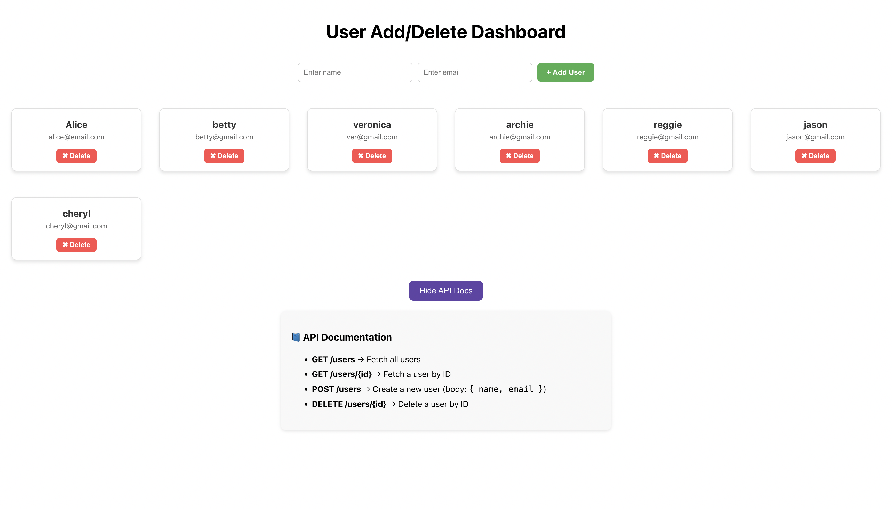

# User Add/Delete Demo

A simple **full-stack demo application** using **React**, **Spring Boot**, and **MySQL** to manage users.  
The app allows you to **add, view, and delete users**. Each user is displayed as a card in the frontend.




---

## 🏗️ Tech Stack

- **Frontend:** React, Axios  
- **Backend:** Spring Boot, Spring Web, Spring Data JPA  
- **Database:** MySQL  

---

## ⚙️ Features

- Add a new user (name + email)  
- View all users in a card layout  
- Delete users  
- API documentation accessible via a button  

---

## 💾 Database Setup

1. Install MySQL and create a database:
   
    - run this to start mysql: mysql -u root -p
    - enter password (yk which one A)

```sql
CREATE DATABASE user_demo;
USE user_demo;

CREATE TABLE users (
    id BIGINT AUTO_INCREMENT PRIMARY KEY,
    name VARCHAR(100) NOT NULL,
    email VARCHAR(100) NOT NULL UNIQUE
);
```

## 💾 Backend Setup

1. Configure database in application.properties:

```
spring.datasource.url=jdbc:mysql://localhost:3306/user_demo
spring.datasource.username=root
spring.datasource.password=your_password
spring.jpa.hibernate.ddl-auto=update
```

2. Run backend

```
./mvn spring-boot:run
```

Backend will run at: http://localhost:8080


## 💾 Frontend Setup

1. Frontend Setup

```
cd user-demo
npm install
npm start
```

Frontend will run at: http://localhost:3000
